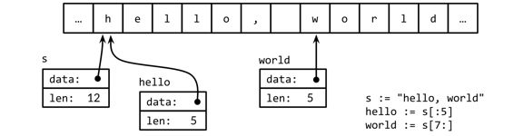
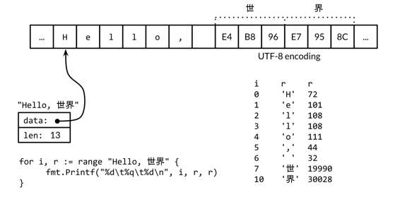

# Chapter 03: Basic Data Types

## 3.5 Strings

A string is an **immutable sequence of bytes**.

Text strings are conventionally interpreted as _UTF-8-endcoded sequences of Unicode_ code points (**rune**).

The built-in `len` function returns the number of bytes (not runes) in a string, and the `index` operation s[i] retrieves the _i-th byte_ of string s, where 0 ≤ i < len(s)

```go
s := "hello, world"
fmt.Println(len(s))     // "12"
fmt.Println(s[0], s[7]) // "104 119"  ('h' and 'w')
```

_The i-th byte of a string_ is not necessarily the i-th character of a string, because the UTF-8 encoding of a non-ASCII code point requires two or more bytes.

The *substring* operation s[i:j] yields a new string consisting of the bytes of the original string starting at index i and continuing up to, but not including, the byte at index j. The result contains j-i bytes.

```go
fmt.Println(s[0:5]) // "hello"
```

The + operator makes a new string by concatenating two strings:

```go
fmt.Println("goodbye" + s[5:]) // "goodbye, world"
```

Strings may be compared with *comparison operators* like == and <; the comparison is done byte by byte, so the result is the natural lexicographic ordering

**String values are immutable**: the byte sequence contained in a string value can never be changed.

Immutability means that it is safe for two copies of a string to share the same underlying memory, making it **cheap** to copy strings of any length. Similarly, a string s and a substring like s[7:] may safely share the same data, so the substring operation is also cheap. No new memory is allocated in either case.

Figure 3.4. The string "hello, world" and two substrings.



### 3.5.1 String Literals

“A string value can be written as a string literal, a sequence of bytes enclosed in double quotes:

> "Hello, 世界”

Within a double-quoted string literal, _escape sequences_ that begin with a backslash \ can be used to insert arbitrary byte values into the string

```txt
\a     “alert” or bell
\b    backspace
\f    form feed
\n    newline
\r    carriage return
\t    tab
\v    vertical tab
\'    single quote (only in the rune literal '\'')
\"    double quote (only within "..." literals)
\\    backslash
```

Arbitrary bytes can also be included in literal strings using hexadecimal or octal escapes. A _hexadecimal escape_ is written \xhh, with exactly two hexadecimal digits h (in upper or lower case). An _octal escape_ is written \ooo with exactly three octal digits o (0 through 7) not exceeding \377

A _raw string literal_ is written `...`, using backquotes instead of double quotes. Within a raw string literal, no escape sequences are processed.

Raw string literals are a convenient way to write regular expressions, which tend to have lots of backslashes. They are also useful for HTML templates, JSON literals, command usage messages, and the like, which often extend over multiple lines

```go
const GoUsage = `Go is a tool for managing Go source code.

Usage:
    go command [arguments]
...
```

### 3.5.2 Unicode

**Unicode** (unicode.org), which collects all of the characters in all of the world’s writing systems, plus accents and other diacritical marks, control codes like tab and carriage return, and plenty of esoterica, and assigns each one a standard number called a Unicode code point or, in Go terminology, a `rune` (int32)

We could represent a sequence of runes as a sequence of _int32_ values. In this representation, which is called _UTF-32_.

### 3.5.3 UTF-8

UTF-8 is a _variable-length encoding of Unicode code points as bytes_. UTF-8 was invented by Ken Thompson and Rob Pike, two of the creators of Go, and is now a Unicode standard. It uses between 1 and 4 bytes to represent each rune, but only 1 byte for ASCII characters, and only 2 or 3 bytes for most runes in common use.

The high-oder bits of the first bytes of the encoding for a rune indicate how many bytes follow.

Many Unicode characters are hard to type on a keyboard or to distinguish visually from similar-looking ones; some are even invisible.

The following string literals all represent the same six-byte string

```go
"世界"
"\xe4\xb8\x96\xe7\x95\x8c"
"\u4e16\u754c"
"\U00004e16\U0000754c"
```

WARN: A rune whose value is less than 256 may be written with a single hexadecimal escape, such as '\x41' for 'A', but for higher values, a \u or \U escape must be used. Consequently, '\xe4\xb8\x96' is not a legal rune literal, even though those three bytes are a valid UTF-8 encoding of a single code point.

Functions often used: `HasPrefix`, `HasSuffix`, `Contains`, `Index`, `Fields`, `Join`.

Figure 3.5 illustrates its representation in memory. The string contains 13 bytes, but interpreted as UTF-8, it encodes only nine code points or runes:



To process those characters, we need a UTF-8 decoder. The unicode/utf8 package provides one that we can use like this:

```go
for i := 0; i < len(s); {
    r, size := utf8.DecodeRuneInString(s[i:])
    fmt.Printf("%d\t%c\n", i, r)
    i += size
}
```

Common functions used: `utf8.RuneCountInString`, `utf8.DecodeRuneInString`

WARN: We mentioned earlier that it is mostly a matter of convention in Go that text strings are interpreted as UTF-8-encoded sequences of Unicode code points

Each time a UTF-8 decoder, whether explicit in a call to utf8.DecodeRuneInString or implicit in a range loop, consumes an unexpected input byte, it generates a special Unicode _replacement character_, '\uFFFD', which is usually printed as a white question mark inside a black hexagonal or diamond-like shape <>.

**NOTE:** UTF-8 is exceptionally convenient as an interchange format but within a program runes may be _more convenient_ because they are of uniform size and are thus easily indexed in arrays and slices.

A []rune conversion applied to a UTF-8-encoded string returns the sequence of Unicode code points that the string encodes:

```go
“// "program" in Japanese katakana
s := "プログラム"

fmt.Printf("% x\n", s) // "e3 83 97 e3 83 ad e3 82 b0 e3 83 a9 e3 83 a0"
r := []rune(s)
fmt.Printf("%x\n", r)  // "[30d7 30ed 30b0 30e9 30e0]"

fmt.Println(string(r[0])) // "プ"
```

### 3.5.4 Strings and Byte Slices

Four standard packages are particularly important for manipulating strings: `bytes`, `strings`, `strconv`, and `unicode`. The strings package provides many functions for searching, replacing, comparing, trimming, splitting, and joining strings.

NOTE: Because strings are immutable, building up strings incrementally can involve a lot of allocation and copying. In such cases, it’s more efficient to use the `bytes.Buffer` type

“The strconv package provides functions for converting boolean, integer, and floating-point values to and from their string representations, and functions for quoting and unquoting strings.”

“The unicode package provides functions like IsDigit, `IsLetter`, `IsUpper`, and `IsLower` for classifying runes”

Function `strings.LastIndex`

“The `path` and `path/filepath` packages provide a more general set of functions for manipulating hierarchical names”

NOTE: A string contains an array of bytes that, once created, is immutable. By contrast, the elements of a byte slice can be freely modified.”

The `bytes` package provides the `Buffer` type for efficient manipulation of byte slices. A Buffer starts out empty but grows as data of types like string, byte, and []byte are written to it”

WARN: When appending the UTF-8 encoding of an arbitrary rune to a bytes.Buffer, it’s best to use bytes.Buffer’s WriteRune

XXX: Exercise `3.10`, `3.11`, `3.12`.

### 3.5.5 Conversion between Strings and Numbers

This is done with functions from the `strconv` package.

To convert an integer to a string, one option is to use `fmt.Sprintf`; another is to use the function `strconv.Itoa` (“integer to ASCII”):”

```go
x := 123
y := fmt.Sprintf("%d", x)
fmt.Println(y, strconv.Itoa(x)) // "123 123”
```

`FormatInt` and `FormatUint` can be used to format numbers in a different base:

```go
fmt.Println(strconv.FormatInt(int64(x), 2)) // "1111011”
```

The `fmt.Printf` verbs `%b, %d, %u, and %x` are often more convenient than Format functions, especially if we want to include additional information besides the number:

```go
s := fmt.Sprintf("x=%b", x) // "x=1111011"
```

To parse a string representing an integer, use the strconv functions Atoi or ParseInt, or ParseUint for unsigned integers:

```go
x, err := strconv.Atoi("123")             // x is an int
y, err := strconv.ParseInt("123", 10, 64) // base 10, up to 64 bits”
```

Sometimes `fmt.Scanf` is useful for parsing input that consists of orderly mixtures of strings and numbers all on a single line, but it can be inflexible, especially when handling incomplete or irregular input

## 3.6 Constants

### 3.6.1 The Constant Generator iota